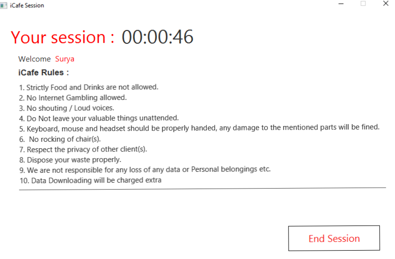
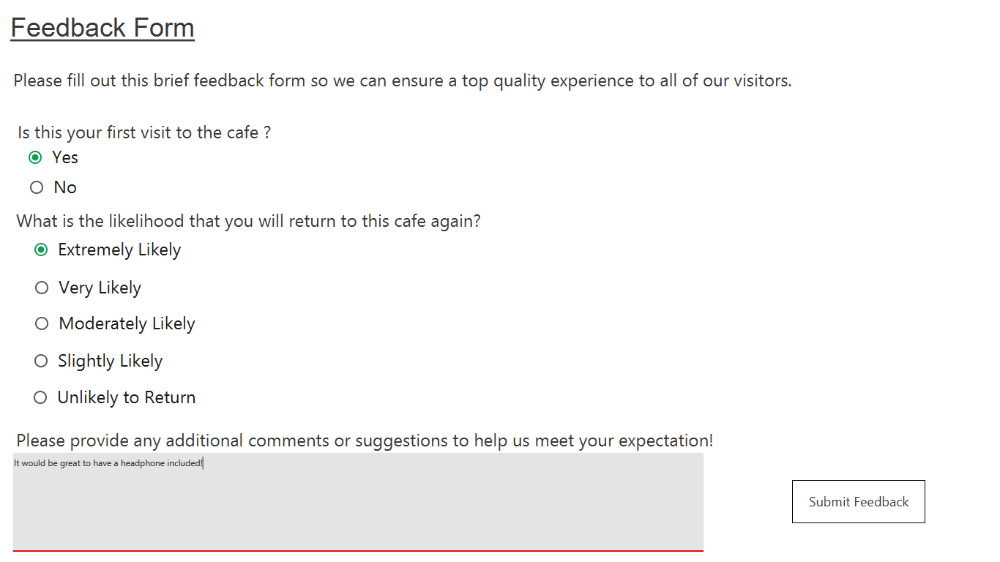

# Cyber-Cafe-System
## ABSTRACT

Cyber Management is a complete package developed for the management of systems in a cyber. This project is intended to be used in a Cyber. All cybers have some basic needs likeable to control the systems that are being rented to the customers and are charged on timely basis. Users can register themselves, Once registered the user can use the services provided by the platform, by starting the session and pay the fee after the session gets ended which allows the user to be entitled under a plan.

A Cyber normally has some number of PC's which the customers will use for a certain amount of time. Naw days it may also require to save some details of the customers for security reasons. When a customer enters a cybercafe, he has to be allotted a PC and the start time is noted. When the customer wants to do some other activities like taking a print out or scan a copy etc, It should be recorded and finally, all the details will be available to the Cyber administrator.

## 1.1 Problem Statement

In the existing system, a lot of manual work has to be carried out and large amount of paper work is involved which may cause high degree of error. Registering of user names, keeping records of user are done manually, which is time consuming process and there is possibility of making errors

Administrator has to keep track of time, which is tedious job. Once the user logs out, while preparing bill, he has referred to user details including name, login time and time allocated leading to possibility of causing errors in bill calculation This may be not beneficial to administrator. Since all these reports are prepared manually, we require computer software for all these purposes

## 1.2 Scope and Importance

The system we propose has great scope in the current real time situation. The cyber crime monitoring can be enhanced to an extent by implementing this system. Most of the firms and establishments are being computerized in order to ease the tasks to be performed. The cyber cafes unfortunately are rarely computerized. We aim through this venture, a better reliable solution

The purpose of the project is to automate cyber cafes. The software must include provisions to keep user details and login history. It should help the cafe owners to retrieve user details when needed. It should help the cafe owner in calculating bill amount and total amount.

Cyber Management System

## SOFTWARE REQUIRMENT

### SPECIFICATIONS

#### 2.1 Functional Requirements:

##### User Login Interface. 

In this page user can specify his username, phone no and email Timer Interface: In this page the user can start the session and end the session

##### Application Interface:
In this page user can access the built-in-applications that has been provided and enjoy it

##### Billing Interface:
In this page bill amount will be displayed including his name and email address

##### Feedback Interface:
In this page user can give a feedback based on his convenience. Admin Interface: In this page admin has to login and can view the complete details of the user validity

#### 2.2 Software Requirements:

DBMS ORACLE 1lg EDITION

IDE: NETBEANS 8.2

Programming language JAVA, SQL.

## Screenshots

Schema

User Login

Session

Bill Amount

Feedback

